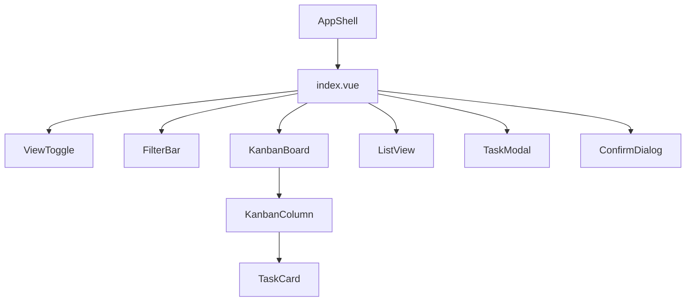

# Task Manager Assessment

A Vue 3 + TypeScript task manager built with Vite and Tailwind CSS. The app supports a kanban board, a list view, task create/edit/delete flows, client-side filtering and sorting, overdue highlighting, and local persistence.

## Setup instructions:

Requirements:

- Node.js 20+ recommended
- npm 10+ recommended

Run locally:

```bash
npm install
npm run dev
```

The Vite dev server will print the local URL, usually `http://localhost:5173`.

Other useful commands:

```bash
npm run build
npm run preview
```

Notes:

- The UI depends on CDN-loaded Google Fonts and Font Awesome icons from `index.html`.
- Tailwind theme tokens are loaded through `@config` in `src/style.css`, pointing at `tailwind.config.ts`.

## What Is Implemented

- Kanban board with `To do`, `In Progress`, and `Done` columns
- List view with sort controls for priority and due date
- Create task modal
- Edit task modal
- Delete confirmation dialog
- Priority and assignee filters
- Overdue visual treatment for non-done tasks
- Name-derived avatar colors so the same assignee always gets the same color
- Empty states for kanban columns
- Local persistence via `localStorage`

## Architecture Overview

### Component hierarchy



### Why the app is structured this way

The page-level entry point is `src/pages/taskManager/index.vue`. It owns modal visibility, current editing state, and delete confirmation state. That component instantiates a single `TaskManager` and passes it down as a prop to presentational children.

`TaskManager` in `src/BLL/taskManager/TaskManager.ts` is the single owner of task state and business rules. It holds:

- the task collection
- current filters
- current sort state
- current active view
- validation rules
- persistence rules
- presentation helpers such as overdue detection, date formatting, initials, and stable avatar colors

### Rendering responsibilities

- `AppShell.vue` handles the persistent chrome: sidebar, topbar, and slot-based page shell.
- `index.vue` orchestrates page state, view switching, modal opening, and delete flow.
- `KanbanBoard.vue` defines column metadata and delegates per-column rendering.
- `KanbanColumn.vue` owns per-column drag/drop behavior and empty state rendering.
- `TaskCard.vue` renders a single card and card-level actions.
- `ListView.vue` renders the tabular representation and sorting UI.
- `TaskModal.vue` handles create/edit form state and field-level interactions.
- `ConfirmDialog.vue` isolates destructive-action confirmation.

## Design Decisions

### 1. Business logic centralized in `TaskManager`

- Filtering, sorting, validation, persistence, overdue logic, and task mutations all need to be consistent across kanban and list views.
- Keeping those rules in one place reduces duplicate logic and makes view components mostly declarative.

What I would do differently with more time:

- Add automated tests around `TaskManager` methods because the class is the highest-value place to lock behavior.

### 2. Two real views backed by one state source

What I chose:

- Kanban and list are different renderers over the same in-memory task state.

Why:

- The screenshots suggest the views are alternative ways to inspect the same dataset, not separate workflows.
- This avoids syncing duplicate state trees and keeps filters/sorting behavior predictable.

What I would do differently with more time:

- Persist list-specific column settings independently from kanban presentation preferences.

### 3. Deterministic avatar colors derived from assignee names

What I chose:

- A stable hash-to-palette mapping for assignee colors rather than hard-coded colors per record.

Why:

- The requirement says the same name must always map to the same color.
- This keeps mock data lightweight and avoids extra color fields in the task model.

### 4. Tailwind tokens for the design system, plus a small CSS layer for interaction polish

What I chose:

- Core colors, radii, shadows, and typography live in `tailwind.config.ts`; small interaction helpers such as line clamp and drag animations live in `src/style.css`.

Why:

- Design tokens belong in one shared configuration so component classes stay consistent.

What I would do differently with more time:

- Move more repeated utility combinations into semantic component classes or extracted primitives to reduce long class strings.

## Known Limitations

- No backend/API integration; data is mock + localStorage.
- Search input in the top bar is visual only.
- Overview | Table tab is present but not implemented as a full feature.
- No automated tests are included in this submission.
- Icons/fonts are CDN-based, so offline rendering may differ.

## Assumptions Made

- Kanban and list should operate over the same task dataset and share filters.
- Sorting applies to the list view; kanban preserves status grouping and does not attempt to reorder cards globally across columns.
- A task marked `done` should never display as overdue, even if its due date is in the past.
- Existing historical overdue dates should remain editable without forcing a due date reset unless the user actively changes the date.
- Desktop parity remained the primary target because the prompt explicitly states the 1280px minimum; mobile support was implemented as a secondary pass.

## Trade-offs

- I optimized for clarity of ownership over framework abstraction. The result is easy to follow, but `TaskManager` is more central than it would be in a larger production system.
- I prioritized design fidelity and interaction polish over adding a broader feature set like real search, multi-select, or full table behavior.
- I used CDN assets for font/icon fidelity rather than bundling them locally. That reduced setup friction but introduces an external dependency.

## Time Log

This is a rough breakdown of the 48-hour window rather than a minute-accurate timesheet.

- 2h: project setup, structure review, data model definition, architecture design and initial scaffolding
- 4h: implementing `TaskManager`, mock data, validation, persistence, sorting, filtering, and helpers
- 4h: kanban board, list view, create/edit/delete flows, and drag/drop behavior
- 2h: visual polish to match the provided reference, including typography, spacing, tokens, modal tuning, and avatar behavior
- 1h: debugging Tailwind config loading, icon/font loading, and runtime visual mismatches
- 1h: limitation review, cleanup, and consistency fixes across components
- 2h: manual verification, iteration against the reference images, and README/documentation

## If I Had More Time

- Add tests for `TaskManager` and the modal validation flow.
- Implement real search and make the placeholder tabs either functional or explicitly disabled.
- Improve accessibility with richer keyboard drag/drop handling and more robust ARIA semantics for menus/dialogs.
- Add visual regression coverage because this assessment has strong screenshot-driven UI requirements.
- Reduce CDN dependency by bundling or self-hosting fonts and icons.

## Project Structure

```text
src/
	BLL/taskManager/
		TaskManager.ts
		mockData.ts
		types.ts
	components/taskManager/
		AppShell.vue
		ConfirmDialog.vue
		FilterBar.vue
		KanbanBoard.vue
		KanbanColumn.vue
		ListView.vue
		TaskCard.vue
		TaskModal.vue
		ViewToggle.vue
	pages/taskManager/
		index.vue
	style.css
```

## Reviewer Notes

- The most important file for application behavior is `src/BLL/taskManager/TaskManager.ts`.
- The most important file for orchestration is `src/pages/taskManager/index.vue`.
- The most important file for design token consistency is `tailwind.config.ts`.
